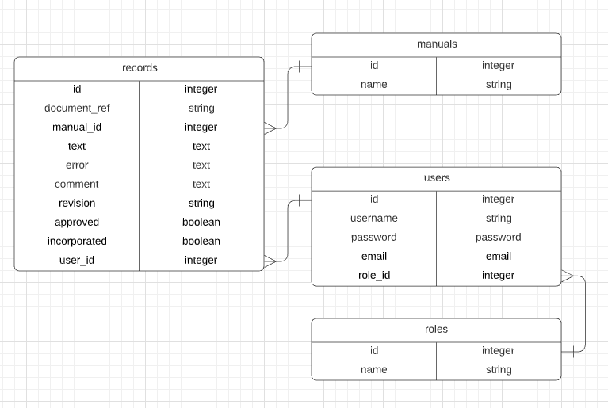
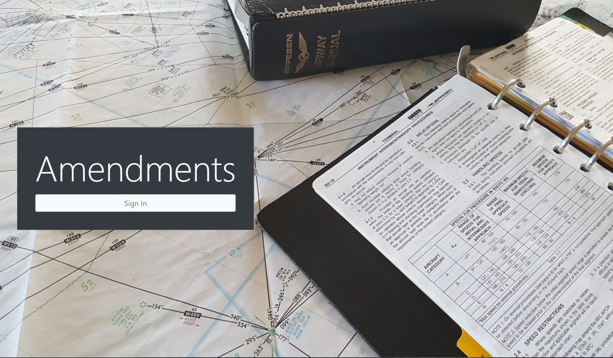

# :airplane: README :airplane:

## :bulb: Purpose

This app was created to assist a client who was amending airline manuals and needed a way to keep track of the amendments.

## :clipboard: Brief 

The brief requested a way to keep track of necessary amendments and the data that would need to be recorded. The workflow was that an amendments would first be identified, then approved and then incorporated into the manual. The client wanted to find a way to highlight amendments had been approved but not incorporated. Any approved users should be able to make changes but the general public should not be able to access any information.

## :ship: Deployment

This app is currently deployed at <http://om-amend.herokuapp.com/>. As the information on the production database is sensitive, only users created by admin can log in. 

## :books: Installation and Setup

1. Install ruby, I recommend using [asdf.](https://asdf-vm.com/)

1. Install git if you don't already have it. Go to the [official docs](https://git-scm.com/downloads) for more information.

1. Git clone the app to your home directory:

    ```bash
    git clone https://github.com/bronwyncarr/records.git
    ```

1. Run <code>bundle install</code> to ensure you have the required dependancies.

## :white_check_mark: Solution

This app includes CRUD functionality for information about a record that needs updating. This includes:
- document reference
- manual
- current text
- error identified
- comment
- revision
- approved (boolean)
- incorporated (boolean)
- who it was created by

After discussions with the client, it was established that this was required for three manuals; hence manuals was created as an entity. This ensures input integrity as the user can select a manual from a dropdown list when adding a new record.

The client wanted anyone in their team to make changes however data not be accessible to anyone outside. A users and a roles entity was created. Devise was used for authentication and Cancancan for authorisation. All users have default role of 'general' and have full ability to manage records. An 'admin' role was created and they have the ability to add or delete users through an admin dashboard. There is no way for new users to sign up except by being added by admin. 

## :computer: Teck Stack

This app uses:
- **Ruby on Rails**
- **PostgreSQL** as the database
- **Bootstrap** for styling
- **Simple Form** for form styling
- **Devise** for authentication
- **Cancancan** for authorisation
- **Rails Admin** for admin dashboard to mange users. 

## :file_folder: ERD



## :camera: Screen shots

Information in the production database is sensitive so all pictures displayed are of seeded entries in the development database.



More to come...

## :construction: Further works

The client requested an MVP in production ASAP so this was achieved within 24 hours. Since then we are continuing to collaborate on extra features that may be useful to them.

Any suggestions are welcome via a PR.
